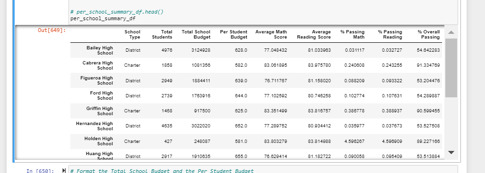

# School District Analysis
Using Jupiter Notes and Pandas to Analyse School district related data

Overview of Project

-Purpose

We completed a detailed analysis of the performance of all the schools in the district and evaluated them based on number of
schhols and students in each, cost, student performance etc and provide the same to our client Maria.

The school board has notified Maria and her supervisor that the students_complete.csv file shows evidence of academic dishonesty;
 specifically, reading and math grades for Thomas High School ninth graders appear to have been altered. Although the school board
 does not know the full extent of the academic dishonesty, they want to uphold state-testing standards and have turned to Maria for
 help. She has asked us to replace the math and reading scores for Thomas High School with NaNs while keeping the rest of the data
 intact. Once we have replaced the math and reading scores, Maria would like us to repeat the school district analysis that we did
and write up a report to describe how these changes affected the overall analysis.

 Analysis and Challenges

There are 15 schools in the district with over 39,000 students. The grades start at 9th and go up to the 12th grade in each school.
The students are evaluate3d on their reading and math scores.

As we deleted just the math and reading scores for the 9th graders in one school(Thomas High School) some of the numbers would be impacted. 
There were 461 students whose scores were zeroed out. An inquiry is being made to see if there was any malpractice in that school.
The student count and names of those 461 students were not deleted.

No specific challenges to mention.

- Results 

The overall average district level  math and reading scores came down to that extent.
There is no impact on costs and budgets as the students from Thomas are still in the student count.
Zeroing out the scores of 461 student may not be appropriate

Please refer to images for more details.
 

- Overall conclusion

A detailed investigation, of the malpractice that possibly happend at Thomas High School, must be undertaken.
The malpractic might be limited to a few students of staff  or it is possible that it was a pure error.
This step of NNs across the board would significantly impact 461 school kids for possibly no fault of theirs

Summary

4 changes

1) Average scores math
2) verage scores n reading
3) Percentage passing 
4) School performance (bottom)
  

